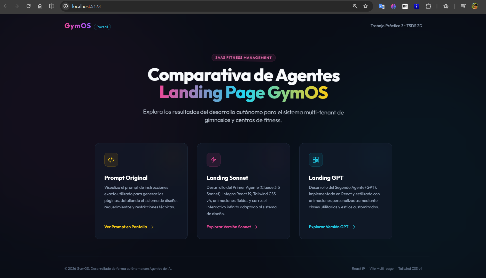
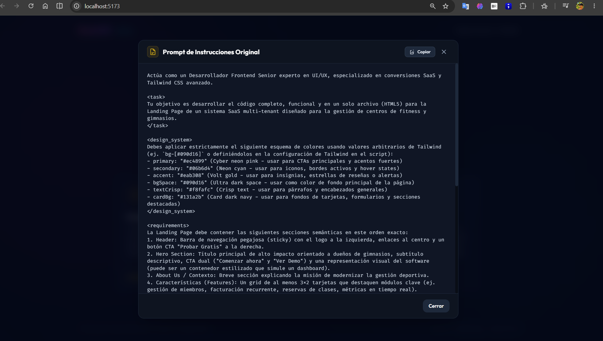
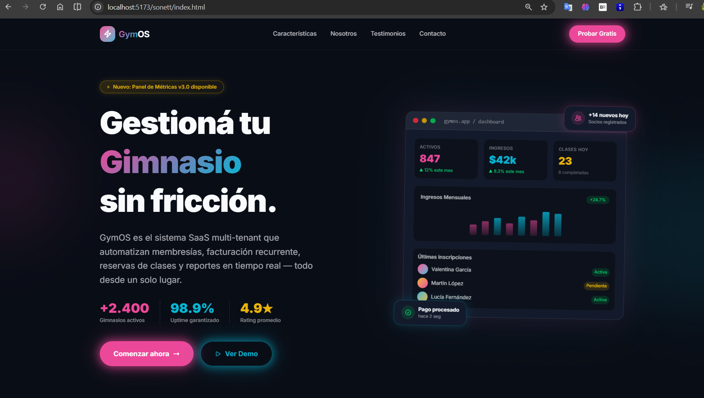
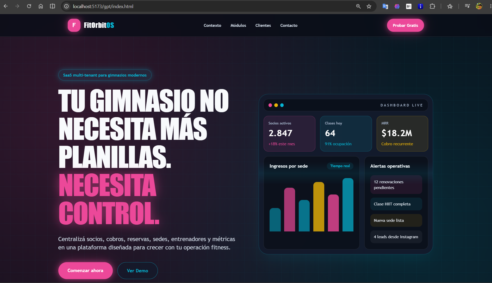

# GymOS – Portal de Acceso y Comparativa de Agentes

* **Autor:** Guillermo Novillo  
* **Materia:** Desarrollo de Sistemas Web (Front End) - 2° D  
* **Despliegue Unificado (Vercel):** [https://tp2-front-rouge.vercel.app/](https://tp2-front-rouge.vercel.app/)

---

## 📝 Prompt Utilizado

```text
Actúa como un Desarrollador Frontend Senior experto en UI/UX, especializado en conversiones SaaS y Tailwind CSS avanzado.

<task>
Tu objetivo es desarrollar el código completo, funcional y en un solo archivo (HTML5) para la Landing Page de un sistema SaaS multi-tenant diseñado para la gestión de centros de fitness y gimnasios. 
</task>

<design_system>
Debes aplicar estrictamente el siguiente esquema de colores usando valores arbitrarios de Tailwind (ej. `bg-[#090d16]` o definiéndolos en la configuración de Tailwind en el script):
- primary: "#ec4899" (Cyber neon pink - usar para CTAs principales y acentos fuertes)
- secondary: "#06b6d4" (Neon cyan - usar para iconos, bordes activos y hover states)
- accent: "#eab308" (Volt gold - usar para insignias, estrellas de reseñas o alertas)
- bgSpace: "#090d16" (Ultra dark space - usar como color de fondo principal de la página)
- textCrisp: "#f8fafc" (Crisp text - usar para párrafos y encabezados generales)
- cardBg: "#131a2b" (Card dark navy - usar para fondos de tarjetas, formularios y secciones destacadas)
</design_system>

<requirements>
La Landing Page debe contener las siguientes secciones semánticas en este orden exacto:
1. Header: Barra de navegación pegajosa (sticky) con el logo a la izquierda, enlaces al centro y un botón CTA "Probar Gratis" a la derecha.
2. Hero Section: Título principal de alto impacto orientado a dueños de gimnasios, subtítulo descriptivo, CTA dual ("Comenzar ahora" y "Ver Demo") y una representación visual del software (puede ser un contenedor estilizado que simule un dashboard).
3. About Us / Contexto: Breve sección explicando la misión de modernizar la gestión deportiva.
4. Características (Features): Un grid de al menos 3x2 tarjetas que destaquen módulos clave (ej. gestión de miembros, facturación recurrente, reservas de clases, métricas en tiempo real).
5. Testimonios: Carrusel o grid (min 3) de reseñas de clientes con estilo tarjeta.
6. Formulario de Contacto: Un formulario maquetado visualmente (nombre, gimnasio, email, mensaje, botón de envío) dentro de un contenedor tipo tarjeta.
7. Footer: Enlaces rápidos, copyright y enlaces simulados a redes sociales.
</requirements>

<technical_constraints>
1. Cero dependencias locales: Utiliza Tailwind CSS a través de su script CDN oficial (`<script src="https://cdn.tailwindcss.com"></script>`).
2. Interactividad y Animaciones: 
   - Utiliza clases nativas de Tailwind para hover, focus y transiciones (`transition-all`, `hover:scale-105`, `duration-300`).
   - Incluye un bloque `<style>` en el `<head>` con animaciones CSS personalizadas (`@keyframes` para flotación suave del dashboard en el Hero, efectos de "glow" (resplandor) en botones usando `box-shadow` con los colores neón, y fade-in al hacer scroll usando animación simple on-load).
3. Completitud Estricta: NO omitas código. Está estrictamente prohibido usar marcadores de posición como "<!-- resto del código -->" o "/* CSS goes here */". El archivo generado debe poder renderizarse perfectamente al abrirlo en el navegador.
4. Accesibilidad y Responsividad: Asegúrate de usar la directiva `md:` y `lg:` de Tailwind para garantizar que el diseño cambie correctamente de móvil (1 columna) a desktop (multiespacio).
</technical_constraints>

<output_format>
Devuelve ÚNICAMENTE el código HTML dentro de un solo bloque de código. No incluyas explicaciones iniciales ni conclusiones. Tu respuesta debe empezar con `<!DOCTYPE html>` y terminar con `</html>`.
</output_format>
```

---

## 📸 Capturas de Pantalla

A continuación se detalla la secuencia visual del flujo de la aplicación:

### 1. Portada de Acceso (Home)
Página principal unificada con estilo espacial y accesos interactivos de efecto neón.


### 2. Modal de Prompt Integrado
Detalle del prompt de instrucciones original visualizado en el modal interactivo de la portada con opción de copiado.


### 3. Landing Page - Agente Sonnet
Versión interactiva en React 19 y Tailwind CSS v4 generada por el agente Claude 3.5 Sonnet.


### 4. Landing Page - Agente GPT
Versión modular estructurada en componentes y animada mediante clases utilitarias por el agente GPT.


---

## 🛠️ Tecnologías del Proyecto

* **React 19 & React 18**: Las implementaciones de las landings corren sobre React con renderizados optimizados de componentes.
* **Vite**: Configuración multi-página en la raíz (`vite.config.js`) que procesa múltiples puntos de entrada de forma optimizada.
* **Tailwind CSS (v4 y CDN)**: Integración mixta que demuestra el uso de Tailwind a través de su CDN nativo y a través de bundles de Vite.
* **CSS Custom Animations**: Keyframes para floats, pulse glows y transitions nativas de Tailwind CSS.
